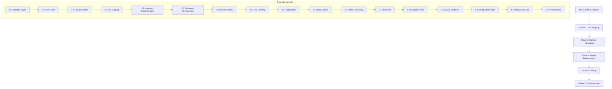

# MCP Client Implementation Plan

## Current State Analysis Summary

**The Problem:** There's an MCP client-server architecture mismatch:
1. **Zuojia (Node.js)** expects: `wiki_list_pages`, `wiki_get_page`, `wiki_search`, `wiki_get_backlinks`, `wiki_build_graph`, `wiki_traverse_graph`, `wiki_neo4j_search`, `wiki_neo4j_get_related`, `wiki_neo4j_find_paths`, `wiki_neo4j_query`
2. **Project Synapse (Python/FastMCP)** provides: `debug_test`, `ingest_text`, `generate_insights`, `query_knowledge`, `explore_connections`, `analyze_semantic_structure`, `wiki_list_pages`, `wiki_read_page`, `wiki_search`, `wiki_write_page`, `wiki_lint`, `wiki_hits_analysis`, `wiki_cluster_pages`, `wiki_update_index`, `wiki_ingest_raw`, `wiki_fetch_url`

**Architecture Gap:** The `project-synapse-bridge.py` launches Project Synapse but there's no RPC communication between Node.js and the Python server.

---

## Implementation Strategy

We'll build a **true MCP client** that:
1. Connects to Project Synapse via stdio JSON-RPC
2. Maps Zuojia's expected tools to Project Synapse's available tools
3. Falls back to local implementations for missing functionality
4. Maintains backward compatibility

---

## Phase 1: MCP Protocol Implementation (Core)

### **Step 1.1: JSON-RPC Transport Layer** ✅ IN PROGRESS
**File:** `/Users/dominickua/code/netwriter/helper/src/mcp/mcp-transport.js`
- Implements stdio communication with external MCP server
- Handles line-delimited JSON-RPC 2.0 messages
- Manages read/write buffers for stdout/stdin
- Provides error handling and reconnection logic
- **Test:** Can send `{"jsonrpc":"2.0","id":1,"method":"initialize"}` and receive response

### **Step 1.2: MCP Client Core**
**File:** `/Users/dominickua/code/netwriter/helper/src/mcp/mcp-client.js`
- Manages MCP protocol lifecycle (initialize, shutdown)
- Caches tool definitions from server
- Implements `tools/call` with timeout and retry logic
- Handles notification messages (`initialized`, `log`)
- **Test:** Can connect, initialize, list tools, and call basic tools

### **Step 1.3: Type Definitions**
**File:** `/Users/dominickua/code/netwriter/helper/src/mcp/mcp-types.js`
- TypeScript interfaces for JSON-RPC messages
- Tool definitions and parameter schemas
- Error types and response formats
- **Test:** Type checking passes without errors

---

## Phase 2: Tool Mapping & Adapter Layer

### **Step 2.1: Tool Name Mapping**
**File:** `/Users/dominickua/code/netwriter/helper/src/mcp/tool-mapper.js`
- Maps Zuojia tool names ↔ Project Synapse tool names
   - `wiki_list_pages` → `wiki_list_pages` (direct)
   - `wiki_get_page` → `wiki_read_page` (requires argument transformation: `slug` → `path`)
   - `wiki_search` → `wiki_search` (direct)
   - `wiki_get_backlinks` → **NO DIRECT MAPPING** (fallback to local)
   - `wiki_build_graph` → **NO DIRECT MAPPING** (fallback to local)
   - `wiki_traverse_graph` → `explore_connections` (partial match)
   - `wiki_neo4j_search` → `query_knowledge` (closest match)
   - `wiki_neo4j_get_related` → `explore_connections` (partial match)
   - `wiki_neo4j_find_paths` → `explore_connections` (partial match)
   - `wiki_neo4j_query` → **NO DIRECT MAPPING** (fallback to local Neo4j)

### **Step 2.2: Argument Transformation**
**File:** `/Users/dominickua/code/netwriter/helper/src/mcp/argument-transformer.js`
- Transforms Zuojia arguments → Project Synapse arguments
   - `wiki_get_page`: `{ slug: "character-bob" }` → `{ path: "character-bob.md" }`
   - `wiki_neo4j_search`: `{ query: "characters", limit: 10 }` → `{ query: "characters", max_results: 10 }`
   - `wiki_neo4j_get_related`: `{ slug: "character-bob", depth: 2 }` → `{ entity: "character-bob", depth: 2 }`

### **Step 2.3: Response Normalization**
**File:** `/Users/dominickua/code/netwriter/helper/src/mcp/response-normalizer.js`
- Normalizes Project Synapse responses to Zuojia expected format
- Handles different result structures and error formats
- Maintains `{ status: 'ok'|'error', data: ..., error: ... }` envelope

---

## Phase 3: Updated MCP Runtime Integration

### **Step 3.1: Update MCP Runtime Manager**
**File:** `/Users/dominickua/code/netwriter/electron/mcp-runtime.js`
**Changes:**
1. Replace `toolExecutor` default with new client-based executor
2. Update `start()` to initialize MCP client connection
3. Update `callTool()` to use client with tool mapping
4. Add connection state management
5. **Test:** All existing tests pass with new implementation

### **Step 3.2: Enhanced Error Handling**
**File:** `/Users/dominickua/code/netwriter/electron/mcp-error-handler.js`
- Graceful fallback to local implementations when Project Synapse unavailable
- Connection failure recovery with exponential backoff
- Tool-specific error messages with helpful suggestions
- **Test:** Handle network failures, server crashes, protocol errors

### **Step 3.3: Runtime Configuration**
**File:** `/Users/dominickua/code/netwriter/electron/mcp-config.js`
- Configurable fallback behavior
- Tool-specific timeout settings
- Connection and retry configuration
- **Test:** Configuration loads correctly and applies to client

---

## Phase 4: Enhanced Bridge Script

### **Step 4.1: Update Python Bridge**
**File:** `/Users/dominickua/code/netwriter/helper/src/mcp/project-synapse-bridge.py`
**Enhancements:**
1. Add command-line arguments for stdio mode vs server mode
2. Implement proper signal handling for clean shutdown
3. Add health check endpoint for Node.js client
4. **Test:** Bridge starts Project Synapse and reports ready state

### **Step 4.2: Bridge Health Monitoring**
**File:** `/Users/dominickua/code/netwriter/helper/src/mcp/bridge-health.js`
- Monitor bridge process health
- Restart bridge if it crashes
- Track bridge initialization state
- **Test:** Bridge restarts automatically after failure

---

## Phase 5: Testing & Validation

### **Step 5.1: Unit Test Suite**
**Files:**
- `test/mcp-transport.test.js` - Transport layer tests
- `test/mcp-client.test.js` - Client protocol tests  
- `test/tool-mapper.test.js` - Tool mapping tests
- `test/mcp-runtime.test.js` - Integration tests
- **Goal:** >90% test coverage for new code

### **Step 5.2: Integration Test Script**
**File:** `/Users/dominickua/code/netwriter/scripts/test-mcp-client.js`
- End-to-end test with actual Project Synapse server
- Validate tool mapping and responses
- Performance benchmarks
- **Test:** Can connect and call tools successfully

### **Step 5.3: Manual Validation Checklist**
1. ✅ Start Project Synapse manually: `uv run python -m synapse_mcp.server`
2. ✅ Run test script: `node scripts/test-mcp-client.js`
3. ✅ Test each tool mapping works correctly
4. ✅ Verify fallback mechanisms work
5. ✅ Test performance with realistic loads

---

## Phase 6: Documentation & Deployment

### **Step 6.1: Update Configuration Documentation**
**File:** `/Users/dominickua/code/netwriter/docs/mcp-integration.md`
- New MCP client architecture overview
- Tool compatibility matrix
- Configuration options
- Troubleshooting guide

### **Step 6.2: Installation Instructions**
**File:** `/Users/dominickua/code/netwriter/docs/setup-project-synapse.md`
- Project Synapse installation steps
- Environment setup requirements
- Testing the integration
- Common issues and solutions

### **Step 6.3: API Documentation**
**File:** `/Users/dominickua/code/netwriter/docs/mcp-client-api.md`
- Client API reference
- Tool reference with examples
- Error handling patterns
- Performance characteristics

---

## Implementation Order & Dependencies

---

## Critical Decisions Needed

### **Decision 1: Error Handling Strategy**
- **Option A:** Silent fallback - Use local implementation without user notification
- **Option B:** Warning with fallback - Log warning but proceed with fallback
- **Option C:** Fail-fast - Show error message and require manual resolution

### **Decision 2: Tool Compatibility Strategy**
- **Option A:** Map all tools to closest Project Synapse equivalent
- **Option B:** Only map exact matches, fallback rest
- **Option C:** Extend Project Synapse later with missing tools

### **Decision 3: Deployment Considerations**
- Should Project Synapse be a required dependency?
- Optional enhancement vs. core feature?
- Installation instructions for users?

---

## Risks & Mitigations

1. **Risk:** Project Synapse tool API changes
   - **Mitigation:** Version checking, adapter pattern, comprehensive error handling

2. **Risk:** Performance overhead of JSON-RPC
   - **Mitigation:** Connection pooling, request batching, caching

3. **Risk:** Process management complexity
   - **Mitigation:** Robust process lifecycle, cleanup handlers, orphan detection

---

## Next Steps

1. **Implement Step 1.1** - JSON-RPC Transport Layer (`mcp-transport.js`)
2. **Implement Step 1.2** - MCP Client Core (`mcp-client.js`)
3. **Implement Step 1.3** - Type Definitions (`mcp-types.js`)
4. Continue through phases in order